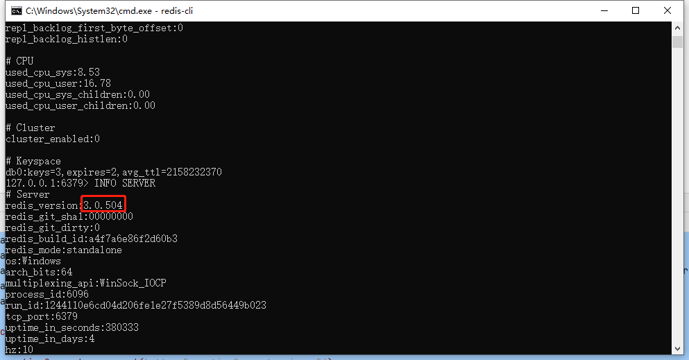

## 遇到的问题：
### 1.GEOADD命令无法使用

原因是redis版本的问题，GEO功能是在redis3.2出来的
> 登录客户端后使用命令"info server" 打印redis服务端版本


### 2.gitignore失效
项目的前端中图片文件夹无需上传，配置gitignore后发现并为生效，一顿摸索时候发现：
> 项目初始化后 .gitignore需要先commit一次，后面的才能扫描文件夹
> 

### 3. git commit后，撤销commit失败
正常来说，普通的撤销 使用命令：
```java
git reset --soft HEAD^
```
HEAD^ 表示上一个版本，即上一次的commit，也可以写成HEAD~1
如果进行两次的commit，想要都撤回，可以使用HEAD~2
不删除工作空间的改动代码 ，撤销commit，不撤销add，使用--soft
删除工作空间的改动代码，撤销commit且撤销add，使用--hard

另外一点，如果commit注释写错了，先要改一下注释，有其他方法也能实现，如：
```agsl
git commit --amend
```
但是❗❗❗，如果第一次commit，用上述方法是无法撤销的，可以使用
```java
git update-ref -d HEAD
```
命令来实现想要的效果。尝试过后，发现commit被成功撤销，仍然保留了add后的结果。

测试了好多次commit才解决 😭

